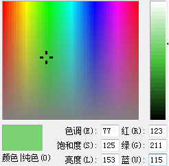
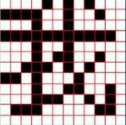
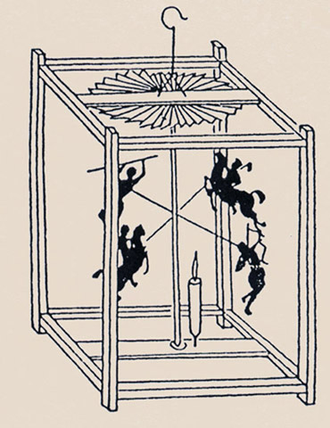
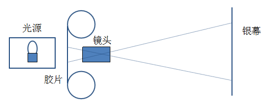
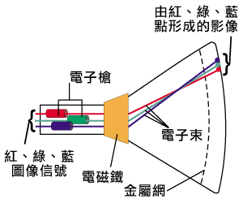

# 流媒体技术及应用的昨天、今天和明天 #

## 视频应用的理论依据

有三个与视频应用相关的理论，第一是人类视觉及在色彩感知方面的特性；第二是人类会把二维排列的点组合成有意义的图像；第三是视觉暂留现象及人类会把一组顺序快速显示的图片组合成一个动态画面。

首先来看人类视觉及其在色彩感知方面的特性，主要有两点，一是三基色，二是人类对于亮度的感知比对于色彩的感知更敏感。任何颜色都可以由三种基本的颜色按照比例混合而成，这三种颜色分别是红色、蓝色、绿色。如右图所示是画图程序的调色板，请注意右下角红绿蓝输入框，通过输入红色、绿色和蓝色的数值，就会组合出一个颜色。

人类对于亮度的感知比对于颜色的感知更加敏感，而三基色这种颜色表示方法并不能体现这个特点。在对模拟信号进行数字化的时候，采用了一个亮度信号和两个色差信号来表示一个点。由于人类对颜色的敏感度相对比较低，于是就减少了色差信号的数量，比如可以把两个点的色差信号合并成一个，这样做的最直接的结果就是数字化后的图像所需的数据量比采用三基色的方法要少很多，间接达到了对图像或者视频压缩的目的。

再来看人类会把二维排列的点组合成有意义的图像。这样的例子我们身边就有很多，如右图所示就能说明这种现象。右图由两种颜色的点组合而成，人会把黑色的部分组合成一个汉字。其实现在很多类似广场等公共场合看到的大屏幕就是由点阵组成的，控制点阵中点的亮度和颜色及其变化，就会回放出动态的画面。

我们平时在计算机上看到的图片事实上就是由不同颜色的点组合而成的，而所谓的分辨率就是指图片的横向和纵向的点数。

最后来看视觉暂留现象及人类会把一组顺序快速显示的图片组合成动态画面，所谓的视觉暂留现象是指眼睛看到的东西会有短暂的停留，电影电视等就利用了视觉暂留现象。

最早利用视觉暂留现象的应用是走马灯。走马灯是在一个或方或圆的纸灯笼中，插一铁丝作立轴，轴上方装一叶轮，其轴中央装两根交叉细铁丝，在铁丝每一端黏上人、马之类的剪纸。当灯笼内灯烛点燃后，热气上升，形成气流，从而推动叶轮旋转，于是剪纸随轮轴转动。它们的影子投射到灯笼纸罩上。从外面看，便成为清末《燕京岁时记》一书中所述“车驰马骤、团团不休”之景况。

## 早期的电影

### 制作技术

电影是利用电影胶片把影像捕捉起来，再加上后期的编辑工作而成。电影的放映过程就是把制作完成的胶片，利用电影放映机投放到银幕上。

电影胶片是将感光乳剂涂在透明、柔韧的片基上制成的。对影像的捕捉用到了三基色的理论。从原理上讲有两大类：一类是由不同比例的红、绿、蓝色相加，得到各种颜色以至白色，这种方法叫做加色法。另一类是从白光中减去不同比例的红、绿、蓝色而得到各种深浅不同的色彩以至黑色，这种方法叫做减色法。

蒙太奇是电影创作的主要叙述手段之一，相对于长镜头电影表达方法。即将一系列在不同地点，从不同距离和角度，以不同方法拍摄的镜头排列组合（即剪辑）起来，叙述情节，刻画人物。这也就意味着电影的场景会不停切换，相对于同一场景的连续画面，场景切换的画面冗余信息就会更少。

### 显示技术

电影的放映过程就是让光透过胶片把影像连续投射到银幕上。下图给出了电影放映的逻辑示意图：

下面是放映的过程：

1. 光源被遮挡
2. 移动胶片前进一帧。
3. 光源遮挡打开，投射到银幕上一帧。
4. 回到第一步。
5. 以上每秒重复24次

在电影放映的过程中，一秒钟要遮挡光源24次，为什么人们没有感觉到，这是因为视觉暂留的缘故。

每秒钟显示的连续画面的个数，就是我们通常所说的帧率。对于电影，我们注意到每秒是24帧，这与我们常见的25帧每秒是有区别的，这在数字化的过程中是需要处理的，并且处理的好坏会对数字化后的视频质量有很大的影响。

# 早期的电视

## 显示技术

RT显示技术。 它是利用阴极电子枪发射电子，在阳极高压的作用下，射向荧光屏，使荧光屏上的荧光粉发光，同时电子束在偏转磁场的作用下，作上下左右的移动来达到扫描的目的。早期的阴极射线管仅能显示光线的强弱，展现黑白画面。而彩色阴极射线管具有红色、绿色和蓝色三支电子枪，三支电子枪同时发射电子打在屏幕玻璃上磷化物上来显示颜色。

CRT电视利用了三基色原理以及人类视觉会把二维排列的点组合成有意义的图像的特点来还原一帧画面。利用视觉暂留现象，电视靠把连续的图像在荧光屏上依次显示出来达到显示运动画面的效果。

为了使得画面更加清晰流畅，电视扫描的方式通常是先扫描奇数行，然后扫描偶数行，这样一帧就分成了两场，分别叫做奇数场和偶数场，这就是所谓的隔行扫描。在显示的时候，由于视觉暂留效应，人眼感觉不到上下半场，而是一个完整的帧。之所以采用隔行扫描还有一个原因就是，逐行扫描消耗时间较长，阴极射线管的荧光衰减会造成闪烁的感觉。

隔行扫描使得画面更加流畅，但是却为后来进行数字化制造了“麻烦”，因为有时候数字化视频需要把奇数场和偶数场合并为帧进行处理，而奇数场和偶数场有一个时间差，如果简单的合并在一起，就会出现毛刺，如右图所示就是未经处理的奇数场和偶数场的合并，结果是运动部分的边缘会出现毛刺。为了去掉毛刺需要进行去隔行处理。

电视内容的传输和显示需要遵循一致的标准，不同国家和地区制定和执行了不同的标准，主要的有NTSC和PAL两种，两者的区别主要在帧率和分辨率上，NTSC的分辨率是720*480，帧率是30，而PAL的分辨率是720*576，帧率是25。

# 模拟信号数字化

为了便于国际间不同标准的节目的兼容，消除数字设备间的制式差别，向着数字电视广播系统参数统一化、标准化迈出，1982年国际无线电咨询委员会CCIR（International Radio Consultative Committee）制定了彩色视频数字化标准，称为CCIR 601标准，后改为ITU-R BT.601标准。该标准规定了彩色视频转换成数字图像时使用的采样频率，RGB和YCbCr两个彩色空间之间的转换关系等。

对于模拟视频进行数字化的过程就是对模拟信号采样的过程，为了保证信号的同步，采样频率必须是电视信号行频的倍数。CCIR为NTSC、PAL和SECAM制式制定的共同的电视图像采样标准，即13.5MHz。这个采样频率正好是PAL、SECAM制行频的864倍，NTSC制行频的858倍，可以保证采样时采样时钟与行同步信号同步。

对于 4:2:2的采样格式，亮度信号用13.5MHz频率采样，两个色差信号分别用6.75MHz的频率采样。除了标准的4:2:2格式之外，还有将色差信号的抽样频率取为3.375MHz的较低标准的4:1:1和4:2:0格式。另外还有为适合更高图像质量要求而将色差信号抽样频率取为13.5MHz的更高标准的4:4:4格式。

根据采样频率，可算出对于PAL和SECAM制式，每一扫描行采样864个样本点；对于NTSC制则是858个样本点。由于电视信号中每一行都包括一定的同步信号和回扫信号，故有效的图像信号样本点并没有那么多，BT 601规定对所有的制式，其每一行的有效样本点数为720点。

BT 601规定，每个样本点都按8位数字化，也即有256个等级。但实际上亮度信号占220级，色度信号占225级，其它位作同步、编码等控制用。如果按fs的采样率、4：2：2的格式采样，则数字视频的数据量为：
720*576＋2*360*576*25 =720*480＋2*360*480*30 = 20.736兆像素/秒
码率为
20.736兆像素/秒*8bit=165.888Mbps。

基于以上叙述，首先想到的就是数字化视频数据量非常大，必须进行压缩，视频编码是必须的。怎么进行视频编码，让它的码率更小那？

